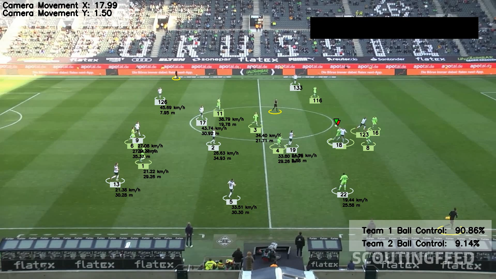

# ⚽ FootBall Analysis System
An advanced Computer Vision & Sports Analytics project for football match analysis.
This system detects and tracks players, referees, and the ball from match videos, then generates insightful statistics such as:
- Player speed (km/h)
- Distance covered (meters)
- Team ball possession percentage
- Camera motion estimation
- Annotated match videos with real‑time overlays




## 🚀 Features
- YOLOv5 Object Detection – detect players, referees, and the ball with high accuracy
- Team Assignment – cluster players into teams using KMeans color segmentation
- Ball Possession Analysis – calculate each team’s ball control percentage
- Camera Motion Estimation – compensate for camera movement using Optical Flow
- Perspective Transformation – convert pixel distances into real‑world meters
- Speed & Distance Estimation – compute per‑player performance metrics

## 🛠 Tech Stack
- Python 3.x
- YOLOv5
- OpenCV
- NumPy, Pandas, Matplotlib
- Supervision
- Roboflow Dataset

## 📂 Project Structure
```
FootBall-Analysis-System/
│── input_videos/        # Place input videos here
│── output_videos/       # Processed videos with analytics
│── models/              # Pretrained YOLOv5 weights
│── utils/               # Helper functions (bbox, video utils)
│── trackers/            # Player tracking logic
│── team_assigner/       # Team classification by jersey color
│── speed_and_distance_estimator/ # Speed & distance calculations
│── camera_movement_estimator/    # Camera motion compensation
│── player_ball_assigner/         # Ball-to-player assignment
│── main.py              # Main entry point
│── README.md
```

## ▶️ Usage
- Place your match video inside input_videos/
- Run the system:
python main.py
- Processed videos with overlays and statistics will be saved in output_videos/

## 📊 Example Output
- Player speed and distance covered
- Team ball possession percentages
- Camera motion vectors
- Annotated video with real‑time analytics
(Insert a sample frame or GIF here for maximum impact)

## 📦 Requirements
pip install ultralytics supervision opencv-python numpy matplotlib pandas


## 📚 Resources
- 📂 Sample Input Video: [Google Drive Link](https://drive.google.com/file/d/1XD6SEx9dE-H5qBUEpfRO85Q9kMeho9LP/view?usp=drive_link)
- 📂 Roboflow Dataset: [Football Players Detection Dataset](https://universe.roboflow.com/roboflow-jvuqo/football-players-detection-3zvbc/dataset/1)
- 📂 Trained YOLOv5 Model: [Google Drive Link](https://drive.google.com/file/d/1gAsgiFV2DAbcxkcP6P-tI6Y-19ErCBTZ/view?usp=drive_link)

## 📌 Future Improvements
- Integrate DeepSORT for more robust multi‑object tracking
- Add a web dashboard (Streamlit/Flask) for interactive analysis
- Extend support to other sports (basketball, hockey, etc.)

## 🎯 About the Project
This project combines state‑of‑the‑art object detection with sports analytics to solve real‑world problems in match analysis.
It demonstrates expertise in:
- Training and deploying YOLOv5 on custom datasets
- Video processing and computer vision pipelines
- Extracting actionable insights from raw match footage
